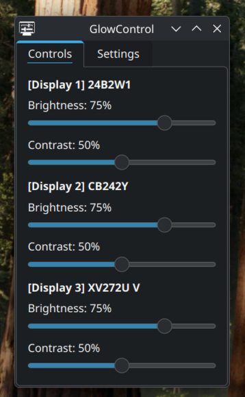
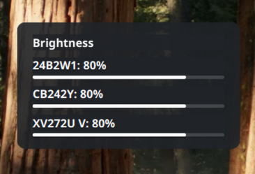

<h1 align="center">GlowControl</h1>

<p align="center">GlowControl is a small app for controlling monitor brightness and contrast over DDC/CI.</p>

<div style="display: flex; justify-content: center; align-items: center;" align="center">
    
    
</div>

## Dependencies

Build dependencies (on Debian-based systems):

```bash
sudo apt install build-essential cmake pkgconf qt6-base-dev libkf6statusnotifieritem-dev libddcutil-dev
```

Runtime dependencies (on Debian-based systems):

```bash
sudo apt install libqt6widgets6 libkf6statusnotifieritem6 libddcutil5
```

The `ddcutil` command-line package is optional. It is useful for checking
monitor support and permissions:

```bash
sudo apt install ddcutil
```

## DDC/CI Permissions (Only test with `ddcutil` installed)

First check whether your monitors are visible to `ddcutil`:

```bash
ddcutil detect
```

If detection needs `sudo` or reports permission errors, enable the I2C kernel
module and add your user to the `i2c` group:

```bash
sudo modprobe i2c-dev
sudo usermod -aG i2c $USER
```

Then log out and back in.

Note that your monitor also needs to support DDC/CI and have it enabled for `ddcutil` and this app to work. Older monitors likely don't support it.

## Build

```bash
cmake -S . -B build
cmake --build build
```

The application should build fairly quickly, outputting to `./build`.

## Run

```bash
./build/glowcontrol
```

Left-click the tray icon to open the controls window. Closing or minimizing the
window hides it back to the tray. Right-click the tray icon to access context menu options.

## Keyboard Shortcuts

GlowControl has a simple CLI, which is useful for KDE custom keyboard shortcuts. You can use these commands with KDE Plasma's custom keyboard shortcut system to create brightness/contrast keys.

Adjust brightness/contrast up/down by 5%:

```bash
glowcontrol --mode brightness --direction up
glowcontrol --mode brightness --direction down
glowcontrol --mode contrast --direction up
glowcontrol --mode contrast --direction down
```

Set an absolute brightness/contrast value (0-100):

```bash
glowcontrol --mode brightness --value 75
glowcontrol --mode contrast --value 50
```

Show the OSD (recommended):
Note: `--osd` / `--native-osd` flags work with all commands, not just the examples below. Add them onto any `glowcontrol` command to show the custom or native OSDs.

```bash
glowcontrol --mode brightness --direction up --osd
glowcontrol --mode contrast --value 50 --osd

glowcontrol --mode brightness --direction up --native-osd
glowcontrol --mode brightness --value 75 --native-osd
```

Show help menu:

```bash
glowcontrol --help
```

## License
GlowControl is licensed under the GNU General Public License v3.0. See [LICENSE](LICENSE) for more details.
